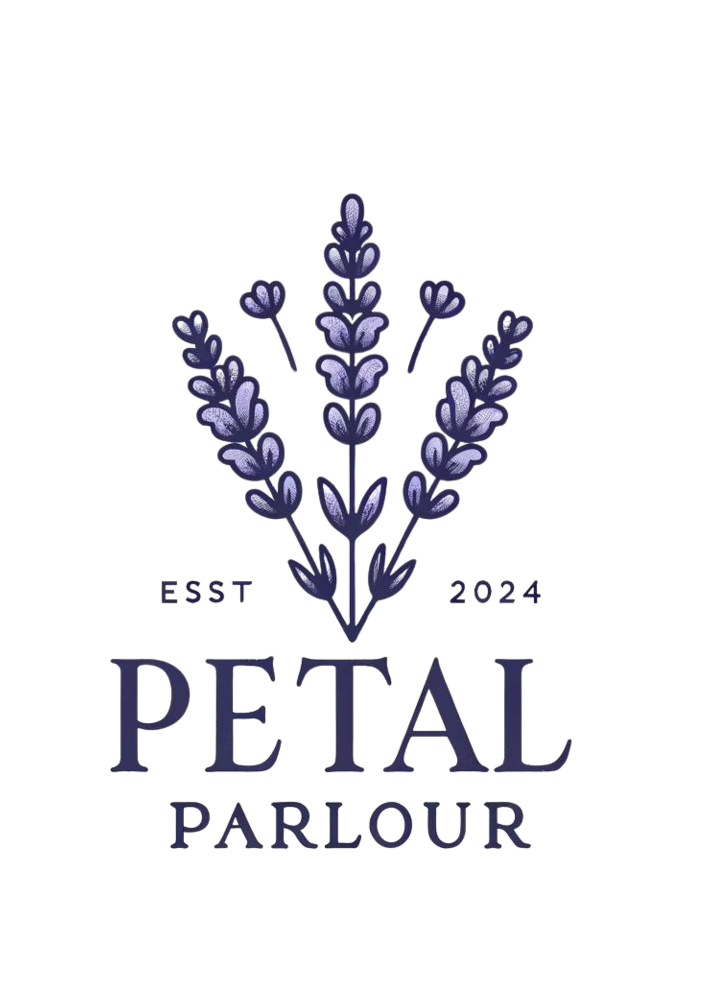

PetalParlour

Welcome to PetalParlour, the enchanting nexus where the love for flowers and the art of storytelling blossom together. This unique social media platform invites botany enthusiasts, storytellers, and anyone captivated by the beauty of flora to explore, share, and connect through the universal language of flowers and narratives.

At PetalParlour, we believe that every flower has a story waiting to be told. From the mysterious allure of night-blooming jasmine to the resilience of the desert rose, PetalParlour provides a canvas for sharing the extraordinary tales behind nature's most beautiful creations. 

Features
Floral Discoveries: Uncover a world of flowers, with contributions from a global community.
Storytelling: Each flower tells a tale. Share yours and read others', from folklore to personal memories.
Community Engagement: Connect with fellow flower and story enthusiasts through comments, likes, and follows.

PetalParlour is built with SASS, as a tryout project for mere learning.

Contributing
We welcome contributions to PetalParlour!
